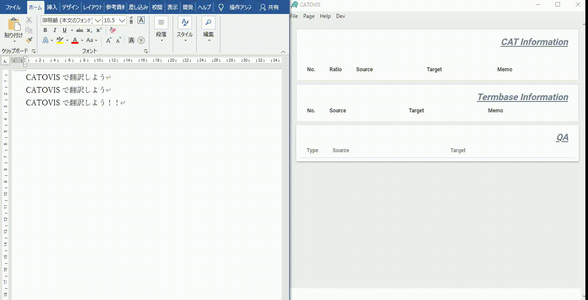

## CATツールをより手軽に
CATOVIS(キャトビス)は「CATツールをより手軽に」を目指したCATツールです。
原文ファイルを開いてすぐにスタートできるよう、原文ファイルの読み込み→XLIFF化ステップの省略をはかりました。

これによりWYSIWYGな、今では見ることの少なくなったクラシックなCAT体験を提供します。

::: tip
2021/6/8現在、最新バージョンは0.7.1です。

[最新版ダウンロード](https://catovis.com/download/catovis071_beta.zip)

[その他ダウンロードページ](https://catovis.com/downloads)
:::

### 部分翻訳、修正翻訳がより簡単に
既存のCATツールは翻訳の前に、ファイル全体の取り込みが必要です。
しかし、実際の業務においては、
- 一部だけ翻訳したい
- 一部だけ重複が多い
- 一部だけ修正が入った

といったニーズも少なくありません。

CATOVISはWYSIWYGな特徴により、部分翻訳でも存分に翻訳メモリ／用語集を活かすことができます。

### 上書き翻訳の愛好者に
翻訳作業は上書きに限る！

そんな声も根強く存在します。

安心してください。CATOVISはWordの上書き翻訳をパワーアップさせます。

### 翻訳以外にも……
機械に頼らないで翻訳をしたけれど、終わってみたら重複が多かった……
そんな経験、ありませんか？
翻訳メモリの使い道は類似文（一致率）の判定だけとは限りません。
似ている文は多くなくても、用語集や数字との突き合わせ（QA）機能や、用例集としての参照など、使いたいシーンは意外と多いものです。

CATOVISはチェックやメモリのメンテナンス（レビュー）のみにも使えるよう、機能を拡張中です。

### 機能リクエスト受付中
CATOVISの開発はまだ小さなツールです。
既存のツールより、柔軟にリクエストに応えられるかも！？

本ツールにより、翻訳やチェックが楽になり、品質や作業性の向上につながることを願っています。
