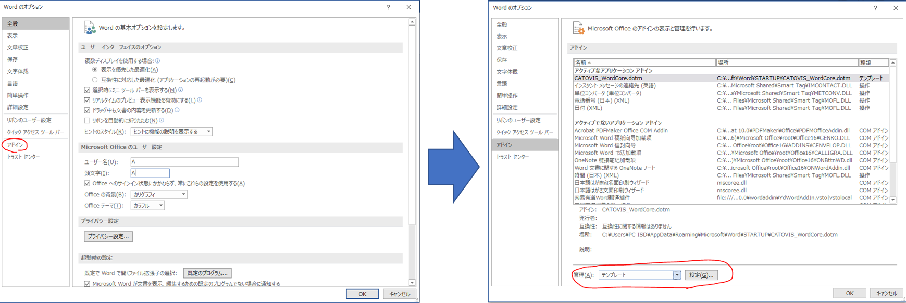
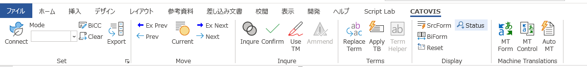

## ファイルのダウンロード

以下のURLよりzipファイルをダウンロードしてください。
特に理由がなければ、最新版を使用することをお勧めします。

[最新版ダウンロード](https://catovis.com/download/catovis071_beta.zip)

または

[その他ダウンロードページ](https://catovis.com/downloads)

::: tip

上記はCATOVISシステム 「全部入り」のインストール版です。
まずはWordの機能だけを試してみたいという方には、インストール不要の「チュートリアル版」を用意しています。
[チュートリアル版ダウンロード](https://catovis.com/download/catovis071_tutorial.zip)

チュートリアル版を使用する場合は、zipファイル展開後、**CATOVIS_tutorial.docm** を実行します。
その後はWordファイル上のテキストまたは[Wordでの操作](./02_vbacore)  を参考にしながら操作を進めてください。

:::

ダウンロードしたzipファイルを展開すると、

- catovis Setup x.x.x.exe
- CATOVIS_WordCore.dotm
- catovis-vba.txt
- TemplateSet.ps1
- UpdataLog.txt

の5ファイルが入っています。

## Wordマクロのインストール

CATOVIS を使うにはまず、Wordマクロ（VBA Core）をインストールします。
Wordが実行中でないことを確認し、「TemplateSet.ps1」のファイルを右クリックして「Powershellで実行」をクリックしてください（ダブルクリックでは実行できません）。

PowerShellが起動し、上図の画面が表示されます。キーボードで「1」を押し、インストールを実行してください。

::: warning ご注意ください

「実行ポリシーの変更」という警告が先に表示された場合は、**Y** または **A** を押して、PowerShellを実行できるようにしてください。

:::

同じフォルダにある **「CATOVIS_WordCore.dotm」** と **「catovis-vba.txt」** が所定の位置にコピーされ、Wordとの連携ができるようになります。

### インストールの確認

上記の処理ができたら、インストールができているか確認しましょう。

Wordを起動して、「ファイル」>「オプション」>「アドイン」の順に進んでください。

最下部のドロップダウンリストから「テンプレート」または「Wordアドイン」を選び、「設定」ボタンをクリックします。

上図のように「アドインとして使用できるテンプレート」の中に「CATOVIS_WordCore.dotm」があり、チェックされていればOKです。

このとき、リボンメニューには **「CATOVS」** という項目が増えています。

このタブにCATOVISに必要なボタンが入っています。

### Wordマクロのインストール　上手くいかなかったら

「TemplateSet.ps1」でマクロが上手く実行できなかった場合は、手動でマクロをインストールしてください。

まずは開いているWordをすべて閉じて終了します。その後、エクスプローラを起動して、「表示」タブの「隠しファイル」にチェックを入れて表示させます。

##### Word2016までの場合

ユーザーフォルダを開き、AppData > Roaming > Microsoft > Word > STARTUPの順に進みます。

このフォルダに「CATOVIS_VBA_Core.dotm」をコピーして、Wordを再起動してください。

##### Word2019 / 365の場合

ユーザーフォルダを開き、AppData > Local > Packages > Microsoft.Office.Desktop_xxxxxxxx > LocalCache > Roaming > Microsoft > Word > STARTUPの順に進みます。
（xxxxxxxxの部分は環境によって異なります）

このフォルダに「CATOVIS_VBA_Core.dotm」をコピーして、Wordを再起動してください。

::: warning

Wordをインストールして、初めて起動するまでは上記の場所に「STARTUP」フォルダがないことがあります。

その場合は一度Wordを起動し、終了してから再度実行してください。

:::

## 本体のインストール

次に **CATOVIS LS** をインストールします。

上記のzipファイルに入っている **「catovis Setup」** をダブルクリックしてインストールを実行してください。

インストールに成功すると、デスクトップとスタートメニューにショートカットが作成されます。

## 起動

**CATOVIS LS** を起動するには、インストール後に作成されたショートカットをダブルクリックするか、スタートメニューに **catovis** と入力して検索してください。

インストールができていれば、次のような画面が表示されます。

::: tip

Wordの機能だけを使う場合は、CATOVIS LSのインストールは不要です。

:::