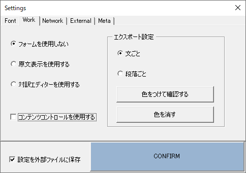
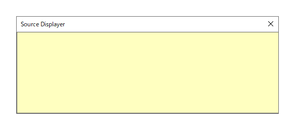
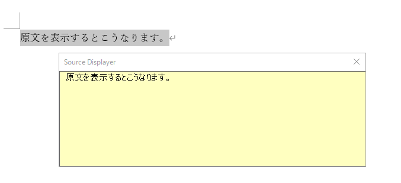
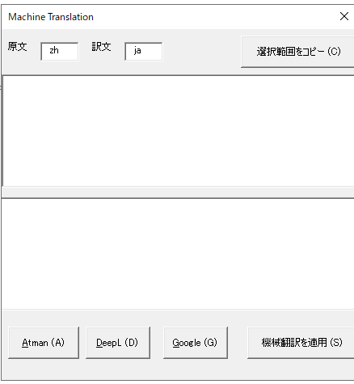
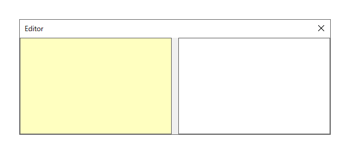
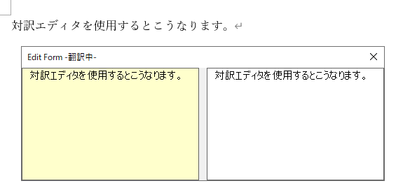
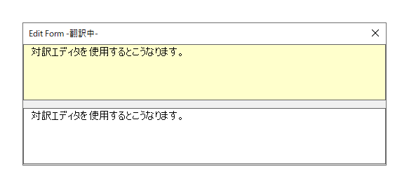
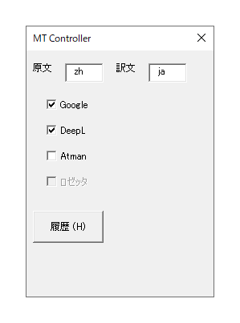
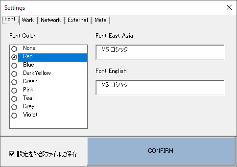

## CATOVIS VBA Core 単独の機能群

CATOVIS VBA Core でWordファイル上で使える機能は、以下の6つです。

1. センテンス単位でのカーソル移動
2. 原文の簡易可視化
3. 機械翻訳の取得（評価版のみ、要登録）
4. 対訳エディタの使用
5. コンテンツコントロールを利用した対訳作成支援
6. 特殊な一括置換
7. 同一センテンスの自動伝播、一括QAなどの作業自動化支援　（開発中）
   
このページでは比較的導入の簡単な **4. 対訳エディタの使用** までについて順に紹介します。
**5. コンテンツコントロールを利用した対訳作成支援** 以降は、[次のページ](./03_vbacore2) を参照ください。

## STEP 1 センテンス単位でのカーソル移動

翻訳を進めるうえで、意味の切れ目として一つの基準となるのが「センテンス（文）」でしょう。
文がどこまで続いているのかを素早く捉えることは、翻訳のスピードアップに役立ちます。

以下で紹介するセンテンス単位でのカーソル移動は、リボンメニューにボタンが用意してあります。
また、ショートカットキーとしてキーボードでの操作も可能です。
以下ではボタン操作とともに、ショートカットも併記しています。
ボタン操作に慣れてきたら、ぜひキーボード操作に移行して、さらなるスピードアップを図ってください。

### 次の文を選択
**Next Segボタン（Alt+→）**

Next Segボタンをクリックすると、現在のカーソル位置から文の終了位置まで選択範囲が移動します。
クリックする前に文字を選択していた場合は、選択範囲が一旦解除され、終了位置から次の文の終わりまでが選択されます。
連続してクリックすることで、どんどん次の文へと移動することができます。

文としての判定はWordの機能を利用しており、基本的には「。」「.」「！」などの文末記号や改行が使われます。

### 次の文まで拡張
**Ex Nextボタン（Ctrl+Alt+→）**

前項にもあるとおり、「次の文を選択」は文末記号や改行までを一つの文として認識します。
しかし、それでは対応しきれない意味の塊もあります。
例えば次の文をみてください。

```
彼は「CATOVISは便利だ。翻訳効率が上がったよ」と言った。
```

この文に対して 「彼」の前にカーソルをおいた状態で **次の文を選択** を実行するとどうなるでしょうか。
期待としては「と言った。」まで選択してほしいところですが、実際には「CATOVISは便利だ。」の句点で選択は止まってしまいます。

このようなときは、**次の文まで拡張**を実行してみてください。

**次の文を選択**とは異なり、現在の選択範囲は解除されないため、結果として *彼は〜と言った。* までを選択できます。
なお、拡張に回数制限はありませんので、目的に応じて拡張し続けることも可能です。

### 前の文を選択
**Prev Segボタン（Alt+←）**

Prev Segボタンをクリックすると、**次の文を選択**とは反対に、現在のカーソル位置から文の開始位置まで選択範囲が移動します。
クリックする前に文字を選択していた場合は、選択範囲が一旦解除され、終了位置から前の文の終わりまでが選択されます。
連続してクリックすることで、どんどん前の文へと移動することができます。

文としての判定はWordの機能を利用しており、基本的には「。」「.」「！」などの文末記号や改行が使われます。

### 現在の文を選択
**Cuurentボタン（Alt+S）**

翻訳の途中では、カーソルが文の切れ目にあるとは限りません。
途中の単語を選択していたり、別のページからマウスクリックで戻ったりすると、翻訳したい文の途中にカーソルが来てしまうでしょう。
そんな時は、**現在の文を選択** を実行してみてください。
カーソル位置から選択範囲が前後に拡張され、一文が選択されます。

なお、この機能は *Sentence* の頭文字をとってショートカットキーに **Alt+S** を当てています。

## STEP 2 原文の簡易可視化

STEP 1 では、カーソルの移動について説明しました。
次に紹介するのは、 **「原文の簡易可視化」** についてです。

Wordで翻訳を進めている場合、元の原文にどんどん上書きしていくことになりますが、その際に原文を常に参照できれば、と考えたことはありませんか？
CATOVIS VBA Core には原文を常にフォームに入れて表示し続けるための機能があります。

### 原文表示フォームの設定

原文を表示させるにはまず、CATOVIS VBA Coreの設定に入る必要があります。
CATOVISタブの左側、**Set** のブロックの右下にある小さな三角を押してください。
次のような設定用フォームが表示されます。




このうち、 **Work** のタブを選び、**原文表示を使用する** にチェックを入れて、**CONFIRM** ボタンをクリックしてください。
※「設定を外部ファイルに保存」はチェックしたままにすることを推奨します。

### 原文表示の開始

設定が完了したら、設定用フォームの × ボタンを押して閉じます。

次に、CATOVISタブの**Display**のブロックにある、**SrcForm** というボタンをクリックしてください。
すると、Wordの画面上に図のような **Source Displayer** という黄色いフォームが表示されます。



この状態でSTEP 1 で説明した **現在の文を選択**を実行します。続けて、CATOVISタブの**Inqure**の にある**Inqure**を押してください。**Source Displayer** に選択中の一文が反映されます。
このテキストはWord上のものとは独立して表示され続けますので、原文を傍に置きながら上書きで翻訳を進めることができます。



また、表示されている内容はクリップボードにコピーすることができますので、検索にも活用できます。

::: tip

Source Displayerのテキストは書き換えることも可能です。
本項で説明しているとおり、これは独立したデータなので原稿には影響がありません。
括弧書きの中身を一旦移動して見通しを良くしたり、複数の対象が列挙されているときに改行してみたりと、原稿自体には手を加えることなく原文の外観を変更することができます。

:::

### Source Displayerの内容変更

**Source Displayer** が表示された状態で、**次の文を選択**、**次の文まで拡張**、**前の文を選択**、**前の文まで拡張**のいずれかを実行すると、**Source Displayer** の表示内容が随時変わります。
**現在の文を選択** を実行した場合は、先ほども説明したとおり即座には反映されません。**現在の文を選択** して表示したい場合、または任意の内容を表示したい場合は、CATOVISタブの**Inqure**の にある**Inqure**をクリックするか、**Alt+↑** を押してください。

### Source Displayer の移動・リサイズ・フォントサイズ変更

#### Source Displayerの移動

**Source Displayer** はタイトルバー部分をドラッグすることで、任意の位置に移動することができます。
また、テキストボックス内にカーソルがある場合は、Ctrlとカーソルキーを組み合わせて移動することも可能です。

#### Source Displayer のリサイズ

**Source Displayer** はサイズの変更もできます。
テキストボックス内にカーソルがある状態で、**Ctrl+Shift+↑/↓** で高さが、**Ctrl+Shift+←/→** で幅が増減します。

#### Source Displayer のフォントサイズ変更

必要に応じて **Source Displayer** のフォントサイズを変えられます。
テキストボックス内にカーソルがある状態で、**Ctrl+Shift+</>** で変更してください。

::: tip

**Ctrl+Shift+</>** はWord や PowerPoint でもフォントサイズの増減に使用できるショートカットキーです。
この機会にぜひ覚えておいてください。

:::

### Source Displayer の位置リセット

大きさに差のあるデュアルディスプレイを使用している場合など、まれに **Source Displayer** が画面外に移動してしまうことがあります。
そのような事象が発生した場合、CATOVISタブの**Display**のブロックにある、**Reset** というボタンをクリックしてください。
**Source Displayer** の位置が左上（X座標：0 Y座標：0）にリセットされます。


## STEP 3 機械翻訳の取得（評価版のみ、要登録）

CATOVIS VBA Coreは機械翻訳を取得するためのインターフェイスも備えています。
Ver 0.7.1現在、実装済みなのは**Google**、**DeepL**、**Atman Cloud Translation** の3つのエンジンです。

::: tip

CATOVIS VBA Core による機械翻訳は、各エンジンともに「ログを残さない」APIを使用しているため、機械翻訳を実行したテキストが保存されることはありません。

:::

::: warning ご注意ください

この機能は現在、MTPEの可能性を模索や、翻訳者の機械翻訳の受容度向上といった目的で開放しているため、パスワードを設定しています。
使ってみたいという方は、個別にご連絡ください。

:::

### 機械翻訳の取得

機械翻訳を取得するには、CATOVIS タブの中の **Machine Translations** ブロックから **MT Form** をクリックします。
すると、図のような **機械翻訳フォーム** が表示されます。



上側のテキストボックスには、クリック時に選択されていたテキストが自動的に入力されています。

次に原文・訳文のロケールをそれぞれ設定し、**Atman**、**DeepL**、**Google** のいずれかのボタンをクリックしてください。
機械翻訳が実行され、結果が下のテキストボックスに入力されます。

::: tip

ロケール名については、下記を参照してください。

[Google](https://cloud.google.com/translate/docs/languages?hl=ja)

[DeepL](https://www.deepl.com/docs-api/translating-text/request/)
※大文字にする必要はありません。

Atman Cloud Translation は en → zh または zh → en 専用です。

:::

### 一部の単語に対する機械翻訳

上側のテキストボックスで、一部の単語・文を選択した状態で、機械翻訳を実行すると、選択していた部分のみに対する機械翻訳が表示されます。

### 機械翻訳の適用

機械翻訳の内容を使用したい場合は、**機械翻訳を適用** ボタンを押してください。
Word上で選択中のテキストが、機械翻訳の内容で上書きされます。

機械翻訳の修正は、Wordファイル上で行ってもテキストボックス内で行っても問題ありません。

### 機械翻訳に関するショートカットキー

機械翻訳を取得するためのフォームは、**Alt+M** を押すことでも呼び出せます。
このとき、ショートカットキーを押した際に選択されていたテキストが原文として入力されます。

また、このショートカットキーは、**Source Displayer** 上でも有効です。
**Source Displayer** でテキストを選択せずに **Alt+M** を押すと全文が、一部を選択中に押すと選択範囲内のテキストがそれぞれ原文として入力されます。

## STEP 4 対訳エディタの使用

原文を常に表示した状態に慣れてくると、今度は翻訳自体もWordファイル上ではなく、原文のすぐ横（あるいは下）に置いて対訳状態で作業したくなってくることでしょう。
そのための機能として、CATOVIS VBA Coreでは対訳機能も提供しています。

### 対訳エディタの設定

対訳エディタを表示させるにはまず、CATOVIS VBA Coreの設定に入る必要があります。
CATOVISタブの左側、**Set** のブロックの右下にある小さな三角を押してください。
次のような設定用フォームが表示されます。


このうち、 **Work** のタブを選び、**対訳エディタを使用する** にチェックを入れて、**CONFIRM** ボタンをクリックしてください。
※「設定を外部ファイルに保存」はチェックしたままにすることを推奨します。

### 対訳表示の開始

設定が完了したら、設定用フォームの × ボタンを押して閉じます。

次に、CATOVISタブの**Display**のブロックにある、**BiForm** というボタンをクリックしてください。
すると、Wordの画面上に図のような **Editor** というフォームが表示されます。



この状態でSTEP 1 で説明した **現在の文を選択**を実行します。続けて、CATOVISタブの**Inqure**の にある**Inqure**を押してください。**Editor** の左右に選択中の一文が反映されます。
左が原文、右が訳文として機能します。右側のテキストボックス内で翻訳を進めることができます。



### 対訳エディタの訳文確定

対訳エディタで翻訳が完成したら、**Alt+Enter** を押します。すると、対訳エディタの右側にある訳文が、先ほど選択した原文の位置に上書きされます。
続けて **次の文を選択** などで選択範囲を移動させてください。対訳エディタの内容が、左右ともに随時変更されていきます。必要に応じて翻訳を行って確定しながら進めることができます。

### 対訳エディタの移動・リサイズ・フォントサイズ変更

対訳エディタの移動・リサイズ・フォントサイズ変更は、おおむね**Source Displayer** と同様です。

#### 対訳エディタの移動

**対訳エディタ** はタイトルバー部分をドラッグすることで、任意の位置に移動することができます。
また、テキストボックス内にカーソルがある場合は、Ctrlとカーソルキーを組み合わせて移動することも可能です。

#### 対訳エディタ のリサイズ

**対訳エディタ** はサイズの変更もできます。
テキストボックス内にカーソルがある状態で、**Ctrl+Shift+↑/↓** で高さが、**Ctrl+Shift+←/→** で幅が増減します。

#### 対訳エディタ のフォントサイズ変更

必要に応じて **対訳エディタ** のフォントサイズを変えられます。
テキストボックス内にカーソルがある状態で、**Ctrl+Shift+</>** で変更してください。

### 対訳エディタの表示形式変更

人によって、または作業内容によっては、原文と訳文を左右で表示するよりも **上下に表示** した方がより便利なことがあります。
その場合は、対訳エディタにカーソルがある状態で、**Ctrl+Enter** を押してください。
押すたびに左右表示と上下表示が切り替わります。



### 対訳エディタの位置リセット

**Source Displayer** と同様に大きさに差のあるデュアルディスプレイを使用している場合などでは、画面外に移動してしまうことがあります。
そのような事象が発生した場合、CATOVISタブの**Display**のブロックにある、**Reset** というボタンをクリックしてください。
**対訳エディタ** の位置が左上（X座標：0 Y座標：0）にリセットされます。

### 対訳エディタと機械翻訳

**対訳エディタ** は **Source Displayer** よりも翻訳作業に習熟した方を主な対象とした機能です。
そのため、機械翻訳も複数のコンテンツを同時に取得して、見比べながら編集できるような機能を有しています。

対訳エディタ用の機械翻訳を使用するには、対訳エディタが表示された状態でCATOVIS タブの中の **Machine Translations** ブロックから **MT Controller** をクリックするか、対訳エディタ上で**Alt＋M**を押してください。すると、図のような **機械翻訳コントローラ** が表示されます。



STEP 3 の機械翻訳と同じ要領で、原文と訳文のロケール名を入力します。次に一括で取得したいエンジンにチェックを入れてください。そのまま対訳エディタにもどり、再度**Alt＋M**を押します。すると、選択していた翻訳エンジンの機械翻訳の結果が、対訳エディタの訳文の最後に追記されます。

### 対訳エディタの特殊機能

対訳エディタ上ではCtrl＋C/V や Ctrl＋Z/Y などよく使うショートカットも有効になっています。それ以外にも様々な機能を追加しています。

#### カーソル位置より前を削除

訳文側テキストボックス内で **Ctrl+Backspace** を押すと、現在のカーソル位置より前のテキストがすべて削除されます。

#### カーソル位置より後ろを削除

訳文側テキストボックス内で **Ctrl+Delete** を押すと、現在のカーソル位置より後ろのテキストがすべて削除されます。

#### 削除の取り消し

上記2つの削除操作は、Ctrl+Z で元に戻すことができません。誤って削除を行ってしまった場合は、**Ctrl+\\** を押してください。

#### 改行の無効化

原文側テキストボックスを自由に改変できるのは、Source Displayerと同様ですが、訳文側でも改行は無視して確定されるようになっています。
そのため、文意の切れ目や「;」で改行しながら翻訳することも可能です。

#### 訳文のフォント設定

翻訳においては、原文と訳文のフォントは異なることが多いと思います。CATOVIS VBA Coreでは、対訳エディタで確定された訳文をWordファイルに反映する際のフォントを設定しておくことができます。

フォントを設定するには、CATOVISタブの左側、**Set** のブロックの右下にある小さな三角を押して設定用フォームを開きます。



このうち、 **Font** のタブを選び、日本語等の全角文字用のフォント **Font East Asia** 及び 半角英数字用のフォント **Font English** にそれぞれフォント名を入力し、**CONFIRM** ボタンをクリックしてください。
