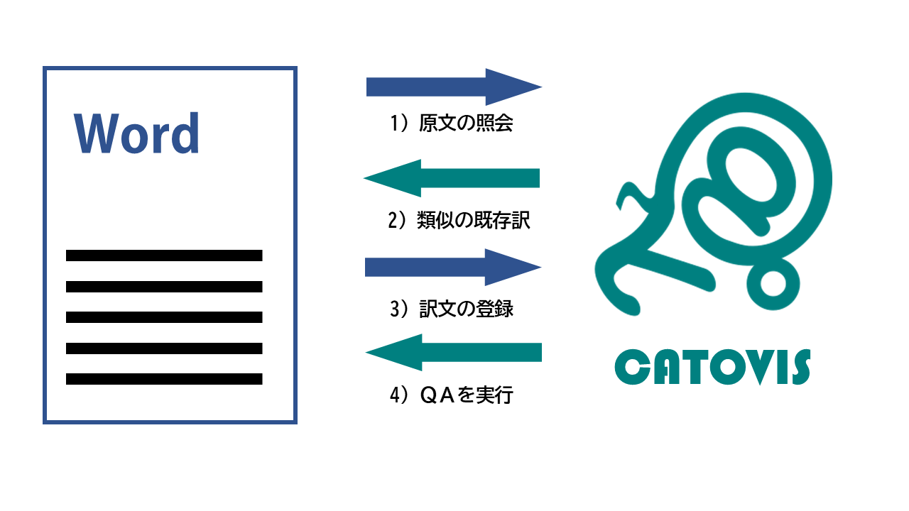
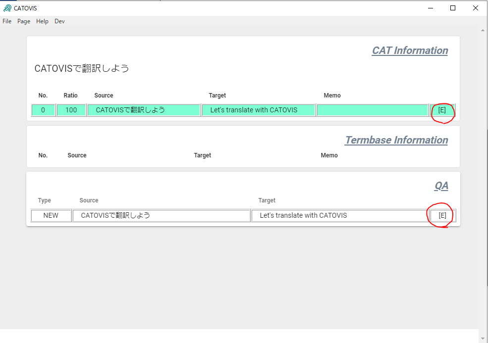

::: warning

**0.4.6未満の場合、以下の操作は、CATOVISが起動している状態で実行してください。起動する前に行うと、Wordが1分ほどフリーズします。**
:::

CATOVISを使ってWordファイルを翻訳する基本的な流れは次のとおりです。

## CATOVISの接続

Word上で **【Alt + F1】** を押します。CATOVISの設定ウィンドウが出てきます。

ここで「Connect」にチェックを入れると、WordとCATOVISが連携されます。

## 原文の照会

翻訳をしたい原文の文頭にカーソルがある状態で、**【Alt + →】** を押します。すると、カーソル位置から一文（。または. まで）が選択されます。

同時に、選択された文がWordからCATOVISに「照会」されます。

## 既存訳の表示と翻訳
Wordから原文の照会を受け取ると、CATOVISは既存の翻訳メモリに似たものがないか、用語集に使用すべき用語はないかといったことを計算し、結果を画面に表示します。
CATOVISが表示する翻訳メモリや用語を参考にしながら、Word上で直接翻訳します。
なお **【Alt + ↓】** を押すことで、最も似ている原文に対応した訳文をWord上に貼り付けることもできます。

### 訳文の登録
照会中の原文に対する翻訳ができたら、訳文の登録を行います。

まずは対応する文をWord上で選択してください。訳文の選択は手動、または **【Alt + ←】** で行うことができます。その状態で **【Alt + Enter】** を押すと訳文が登録されます。

訳文の登録時には以下のQAが、リアルタイムで実行されます。

- 用語エラー
- 数字の不一致

QAの結果、問題が一つもなかった場合、照会中の原文にチェックマークがつきます。

一つでも問題が検出された場合は、原文に「！」が付きますので、QAの中身を確認してください（問題があっても訳文の登録自体は完了しています）。

## 訳文の修正
照会または登録時の選択範囲が間違っていると、間違えたまま保存されてしまいます。

そんな時は*CAT Information*か*QA*の表部分の右側にある **[E]** マークをクリックしてください。

原文・訳文ペアの修正ウィンドウが開きますので、適宜修正を加えた後、「Confirm」ボタンをクリックしてください。

また修正ウィンドウでは、メモや用語集の登録（後述）も可能です。

## 訳文の削除

誤って訳文を登録してしまったら、修正ではなく削除することもできます。

修正と同じ手順で **[E]** マークをクリックしてください。修正ウィンドウの下側に「DELETE」ボタンがあります。

DELETEボタンは間違って押してしまわないよう、2回クリックする必要があります。1回クリックすると、ボタンが赤くなります。赤くなったボタンを押すと、翻訳メモリを削除できます。

### 用語集の登録
修正ウィンドウが開いた状態で、用語を登録することができます。

原文・訳文（・メモ）から用語集として登録したい部分を選択し、**【Ctrl + T】** を押してください。テキストボックスの下に用語の候補が並びます。原文・訳文（・メモ）の用語を合わせて「Add Term」ボタンをクリックすると、用語集に登録されます。

メモの入力は任意ですが、原文と訳文から取り出す用語の数は同じでなければなりません

## プロジェクトの保存
翻訳メモリ、用語集、設定ファイルをひとまとめにして保存することができます。
Fileメニューから*Save*または*Save as*を選択してください。ファイルはプロジェクトzip形式（pjtzip）で保存されます。

::: tip プロジェクトzipの中身
pjtzipはその名のとおり、zip形式で必要なファイルを集めたものになっています。
圧縮・展開ツールなどを使えばJSON形式の設定ファイル、翻訳メモリ、用語集を個別に見ることができます。
また、展開して取り出したJSONファイルは個別にインポートすることも可能です。
[JSONってなに？](../faq/index.html#jsonってなに？)
:::