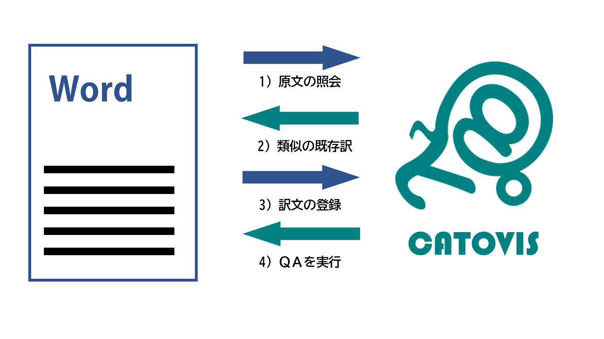
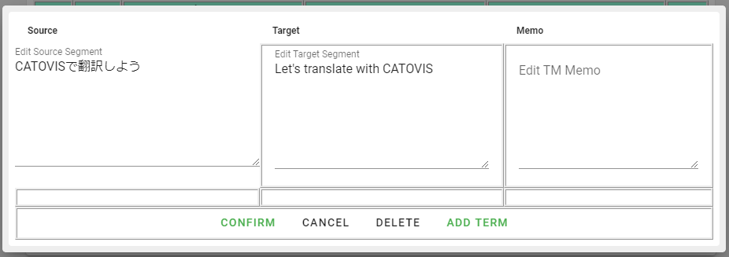

## ローカルサーバー型の翻訳支援ツール

CATOVIS LSとはローカルサーバー型の翻訳支援ツール（CATツール）です。Local Serverの頭文字をとって、**CATOVIS LS** と表記しています。
ローカルPCで動作するので、（機械翻訳など一部の機能を除き）外部との通信がなくても使えるのが特徴です。

CATOVISを使ってWordファイルを翻訳する基本的な流れは次のとおりです。

なお、**CATOVIS LS**との連携も、対訳エディタを使用するのが最も便利ですが、原文表示やそのままの上書きでも連携可能です。

## CATOVISの接続

CATOVISタブのうち、**Set** のブロックの左端にある **Connect** ボタンを押します。

これでWord側（VBA Core）とCATOVIS LSが連携して作業することができるようになります。

## 原文の照会

翻訳をしたい原文の文頭にカーソルがある状態で、**次の文を選択** を実行します。すると、Word側でカーソル位置から一文が選択されるのと同時に、選択された文がWordから**CATOVIS LS**に「照会」されます。

## 既存訳の表示と翻訳

Wordから原文の照会を受け取ると、**CATOVIS LS**は既存の翻訳メモリに似たものがないか、用語集に使用すべき用語はないかといったことを計算し、結果を画面に表示します。
**CATOVIS LS** が表示する翻訳メモリや用語を参考にしながら、Word上で直接翻訳します。
この際、Word側でCATOVISタブのうち、**Inquire** のブロックにある **Use TM** ボタンを押すか、**Alt+↓** を押すことで、最も似ている原文に対応した訳文をWord上に貼り付けることもできます。

なお、対訳エディタを使用している際は、対訳エディタ上で**Alt＋↓**を押すようにしてください。**Use TM** ボタンを押した場合、Wordファイルに直接訳文が入力されてしまいます。

## 訳文の登録

照会中の原文に対する翻訳ができたら、訳文の登録を行います。

対訳エディタを使用している際は、**Alt+Enter** を押して対訳エディタ上の訳文を確定させると、**CATOVIS LS**への登録も行われます。

Word上で翻訳している場合は、まず訳文を選択する必要があります。訳文の選択は手動、または **前の文の選択** などで行うことができます。その状態で **Alt+Enter** を押すと訳文が登録されます。

訳文の登録時には以下のQAが、リアルタイムで実行されます。

- 用語エラー
- 数字の不一致

QAの結果、問題が一つもなかった場合、照会中の原文にチェックマークがつきます。

一つでも問題が検出された場合は、原文に「！」が付きますので、QAの中身を確認してください（問題があっても訳文の登録自体は完了しています）。

## 訳文の修正

照会または登録時の選択範囲が間違っていると、間違えたまま保存されてしまいます。

コンテンツコントロールを使用していると、Word上で簡単に訳文の修正ができます。
コンテンツコントロール上で訳文を修正した後、コンテンツコントロールにカーソルが置かれている状態で **Alt+Enter** を押してください。
すると、そこに記録されている原文に対応する訳文が、現在の訳文に置き換わります。

コンテンツコントロールを使用していない場合、**CATOVIS LS** 上で修正をする必要があります。

*CAT Information*か*QA*の表部分の右側にある **[E]** マークをクリックしてください。

原文・訳文ペアの修正ウィンドウが開きますので、適宜修正を加えた後、「Confirm」ボタンをクリックしてください。

**
また修正ウィンドウでは、メモや用語集の登録（後述）も可能です。

## 訳文の削除

誤って訳文を登録してしまったら、修正ではなく削除することもできます。

修正と同じ手順で **[E]** マークをクリックしてください。修正ウィンドウの下側に「DELETE」ボタンがあります。

DELETEボタンは間違って押してしまわないよう、2回クリックする必要があります。1回クリックすると、ボタンが赤くなります。赤くなったボタンを押すと、翻訳メモリを削除できます。

### 用語集の登録
修正ウィンドウが開いた状態で、用語を登録することができます。

原文・訳文（・メモ）から用語集として登録したい部分を選択し、**【Ctrl + T】** を押してください。テキストボックスの下に用語の候補が並びます。原文・訳文（・メモ）の用語を合わせて「Add Term」ボタンをクリックすると、用語集に登録されます。

メモの入力は任意ですが、原文と訳文から取り出す用語の数は同じでなければなりません

## プロジェクトの保存
翻訳メモリ、用語集、設定ファイルをひとまとめにして保存することができます。
Fileメニューから*Save*または*Save as*を選択してください。ファイルはプロジェクトzip形式（pjtzip）で保存されます。

::: tip プロジェクトzipの中身
pjtzipはその名のとおり、zip形式で必要なファイルを集めたものになっています。
圧縮・展開ツールなどを使えばJSON形式の設定ファイル、翻訳メモリ、用語集を個別に見ることができます。
また、展開して取り出したJSONファイルは個別にインポートすることも可能です。
[JSONってなに？](../faq/index.html#jsonってなに？)
:::