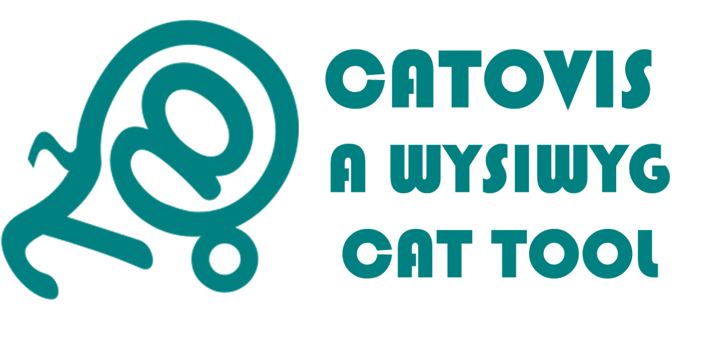
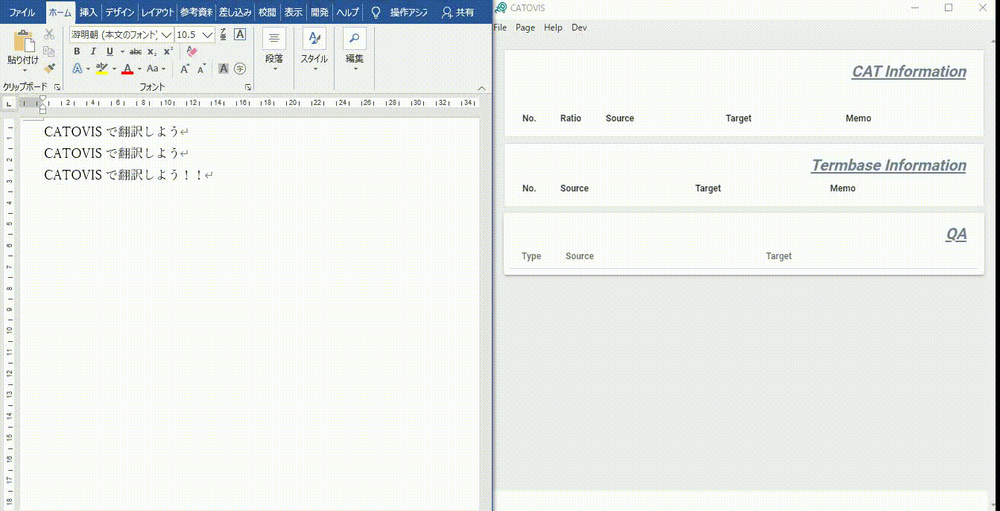

## 让CAT工具更为轻易近人
CATOVIS是以“让CAT工具更为轻易近人”为概念开发的CAT工具。
它省略了将原文文件转换为XLIFF的步骤，以在打开原文文件后立马开始作业。

由此实现了现在已几乎消失不见的WYSIWYG型CAT工具。

::: tip
截止至2020/2/26，最新版本为0.4.7。
[下载](https://github.com/QuanKaoYang/catovis-docs/tree/master/catovis)
:::

### 仅一部分的翻译、翻译的修正作业变得更轻松
已有的CAT工具需要在开始翻译之前读取整体文件。
不过在现实业务中，其实有更多样的需求，例如：
- 只对文件的一部分进行翻译
- 只有一少部分是重复的
- 只对原文的一少部分发生了修正

CATOVIS因是一种WYSIWYG型程序，即使是对文件的一部分仍可灵活运用翻译记忆（TM）和词汇库（TB）的益处。

### 不仅是翻译业务……
仅凭人力完成了翻译，不过回头看看，这个稿子中重复的部分还是不少啊……
您是否有过这样的经历？
翻译记忆，其实亦可用于更多场景。
就算相似的句子不多，还可应用数字和术语的核对功能，或者用作双语语料库，节省查看参考资料的时间等等。
仅用相似度的计算，是不是浪费资源呢？

为适合审阅、资源维护等作业，我们正在努力开发CATOVIS的各种新功能！

### 欢迎洽询和建议
CATOVIS，目前只不过是小小的工具。
但是，因为是小小的，或许更能灵活地吸纳各种需求！？

我们希望凭借该工具，减轻翻译和审阅作业的负担，进而为效率和质量的提高做出贡献。
