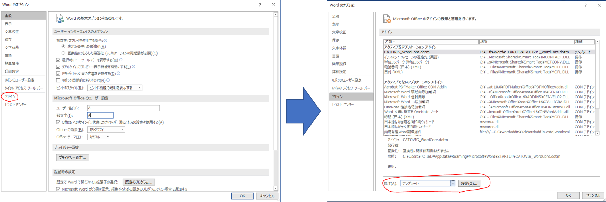

## 安装CATOVIS

请从下述网址下载zip文件。

[下载最新版本](https://catovis.com/download/catovis051.zip)
[跳转至其他版本及工具下载页](https://catovis.com/downloads)

请点击适当的文件。如无特殊理由，建议使用最新版本。

解压所下载的zip文件，出现下列4个文件：

- catovis Setup x.x.x.exe
- CATOVIS_VBA_Core.dotm
- TemplateSet.ps1
- UpdataLog.txt

双击其中的“catovis Setup”，执行安装。

安装成功后，系统会在桌面上和开始菜单中生成捷径。

::: tip

若下载0.4.5或以下版本，没有 **CATOVIS_VBA_Core.dotm** ，其文件名为 **SelectAndRequest.dotm** 。 

:::

## 安装Word宏
其次安装连接CATOVIS和Word的宏。右击“TemplateSet.ps1”，选择“使用 PowerShell 运行”（无法通过双击执行）。

稍后PowerShell会开启，弹出如上所示的界面。敲打“1”，执行安装。

这样一来，在同一个文件夹中的“CATOVIS_VBA_Core.dotm”会被复制到相应位置，实现CATOVIS和Word的连接。

### 确认Word宏的安装状态
启动Word，按“文件”> “选项” > “插件”的顺序依次点进。

最下方的下拉菜单中选择「模板」或「Word加载页」，并点击「设置」按钮。

如上图所示，如果在“共用模板及加载项”一栏中有“CATOVIS_WordCore.dotm”的名字，且选择框被打钩即可。

### 如果Word宏的安装失败
如果上述步骤没能安装“TemplateSet.ps1”，请尝试手动安装。

首先要关闭所有Word文件，结束应用程序。接着，启动探索者，在“显示”标签卡的隐藏文件上打钩，让其有效化。

##### Word2016或以前

打开用户文件夹，按AppData > Roaming > Microsoft > Word > STARTUP的顺序依次点进。

在该文件夹中复制“CATOVIS_VBA_Core.dotm”后，重启Word。

##### Word2019 / 365

打开用户文件夹，按AppData > Local > Packages > Microsoft.Office.Desktop_8wekyb3d8bbwe > LocalCache > Roaming > Microsoft > Word > STARTUP的顺序依次点进。

在该文件夹中复制“CATOVIS_VBA_Core.dotm”后，重启Word。

::: warning
在安装Word后一次都没有启动过的化，有可能无法找到上述「STARTUP」文件夹。

在这种情况下，先启动、结束一次Word后，重新进行上述步骤。
:::

## 启动
双击桌面上生成的捷径，或在开始菜单中输入catovis并点击图标，来启动CATOVIS。
