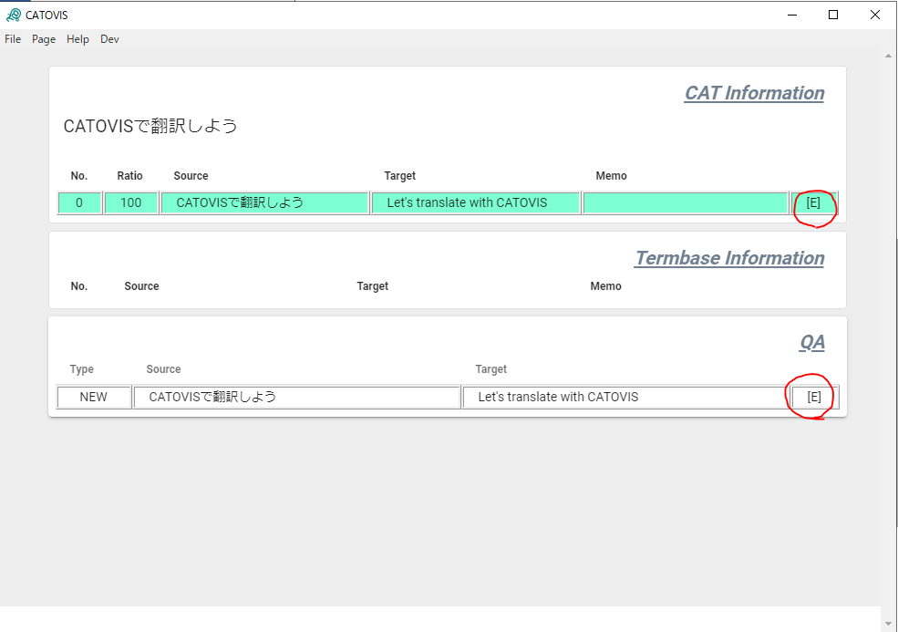
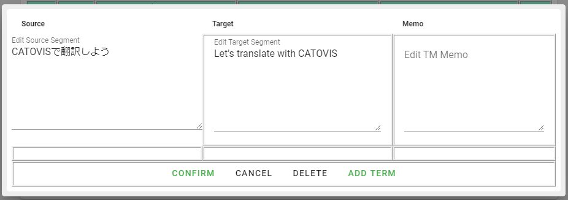

::: warning

**若是0.4.5或以下版本，请在启动CATOVIS后执行下述步骤，不然Word会死机1分钟左右**
:::

使用CATOVIS翻译Word文件的基本流程如下所示。

## 与CATOVIS连接

在Word上按 **【Alt + F1】** ，会弹出CATOVIS的设置窗口。

在该窗口上打钩“Connect”，会建立Word与CATOVIS的连接。

## 查询原文

在光标处于要翻译的原文句子前端的状态下，按下 **【Alt + →】** 。随后，光标从当前位置移动到下一句开始之前的位置（。或. 前面），并选中相应部分。

榆次同时，Word会向CATOVIS发出“查询”请求。

## 边参照以往翻译，边进行翻译
接到来自Word的原文查询后，CATOVIS会开始计算该句与翻译记忆库里面的句子的匹配度，以及词汇库是否有应当使用的词，并在界面上显示结果。
您可以边参照CATOVIS显示的与翻译记忆库的匹配情况和词汇，边在Word上直接进行翻译。
在翻译的过程中，也可以按下 **【Alt + ↓】** 来张贴匹配度最高的译文。

### 注册译文
翻译好正在查询的原文后，接着要注册译文作为翻译记忆。

首先在Word上选中相应的句子。译文的选择可以用手动进行，也可以按下 **【Alt + ←】** 来选择上一个句子。在译文被选中的状态下按下 **【Alt + Enter】** 即可注册译文。

注册译文时，CATOVIS会及时执行QA，确认如下两种内容。

- 是否遵循词汇要求
- 数字是否一致

执行QA后，如果没有问题，在CATOVIS界面上的原文左上角会出现蓝色的钩形图标。

发现一个以上的问题时，会显示红色的“！”号。此时请确认QA的具体内容（即使显示问题，此时译文已被注册）。

## 修正译文
万一您查询或注册时的选中范围有误，会出现注册错误的翻译记忆的情况。

此时，可以点击*CAT Information* 或 *QA* 表格右侧的 **[E]** 图标。

CATOVIS上会弹出原文和译文的修正窗口，适当修正后点击“Confirm”按钮。

同时，在修正窗口上也可以写入备注，还可以注册词汇（详情见下文）。

## 删除译文

错误地注册译文时，也可以直接删除该翻译记忆。

与修正同样，点击 **[E]** 。之后，点击修正窗口的下方的“DELETE”按钮。

DELETE按钮点击两次后才成效，以防错误地删掉。点击1次后，按钮会变红；再次点击红色的按钮，即可删除该翻译记忆。

### 注册词汇
在修正窗口上还可注册词汇。

在原文、訳文（如有备注）中分别选择欲注册的部分，按下 **【Ctrl + T】** 。在文本框下方会出现这些候选词汇。在原文和译文的词汇的个数相同的情况下，点击“Add Term”按钮，即可注册词汇。

备注可以填入，也可以不填入，但是原文和译文的词汇的个数必须相同。

## 保存项目
CATOVIS可以成套保存翻译记忆库、词汇库、设置文件。
从File菜单中选择*Save* 或 *Save as*。项目文件会以项目zip格式（pjtzip）予以保存。

::: tip 项目zip的内容
字如见人，pjtzip是将所需文件根据zip格式压缩而成的。
因此使用压缩解压软件可以单独提取、查看JSON格式的设置文件、翻译记忆库以及词汇表。
解压提取的JSON文件亦可分别进行导入。
[JSONってなに？](../faq/index.html#jsonってなに？)
:::